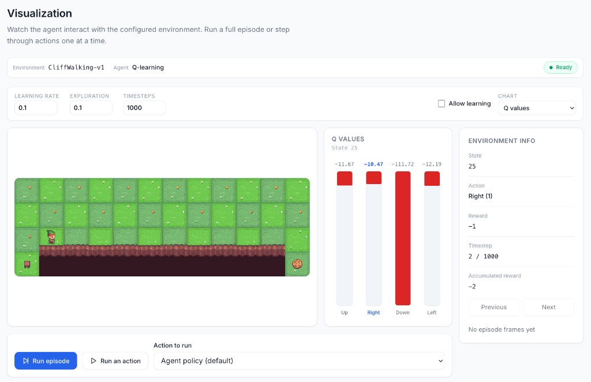

# RL Trainer

A Flask web app for visualizing and training reinforcement learning agents in Gymnasium environments. Choose an environment and a tabular agent (MC, SARSA, or Q-learning), set hyperparameters, then step through or run episodes while watching the environment render.



The screenshot shows the **Visualization** tab for Cliff Walking (`CliffWalking-v1`) with Q-learning. The environment render, Q-value chart, episode info, and action controls sit side by side so you can follow what the agent sees and why it picks each action.

## Installation

```bash
python3 -m venv venv
source venv/bin/activate        # on Windows: venv\Scripts\activate
pip install -r requirements.txt
```

## Running

```bash
python3 app.py
```

Open http://127.0.0.1:5000 in the browser.

## Workspace tabs

The sidebar has four tabs that share the same experiment configuration.

- **Environment** — Select a Gymnasium environment (Toy Text or Classic Control) and an agent (tabular MC, SARSA, Q-learning, or Stable-Baselines3). Apply the configuration so Visualization, Analysis, and Training all use the same setup. You can also save and load learned agents from disk.
- **Visualization** — Watch the agent interact with the environment. Adjust learning rate, exploration, and timestep budget; optionally allow learning while you explore. Run a full episode or a single action (agent policy or a chosen action). The layout shows the live render, a chart of Q-values (or related views) for the current state, and episode stats (state, action, reward, timestep, accumulated reward), with previous/next controls to step through recorded frames.
- **Analysis** — Inspect what the tabular agent has learned. The Q-table view lists state–action values for the current agent. Additional views (policy, value function, and metrics) are reserved for later.
- **Training** — Set hyperparameters and a timestep budget, then run training episodes for the selected tabular agent and monitor episode reward as learning progresses.

## Structure

```
app.py                      # Flask server and API endpoints
src/env_runner.py           # Gymnasium runtime, tabular agents, save/load
src/agents/                 # Agent implementations (tabular and DRL)
templates/                  # Pages for the four workspace tabs
static/css/                 # Styles
static/js/                  # Layout and experiment-context scripts
```
